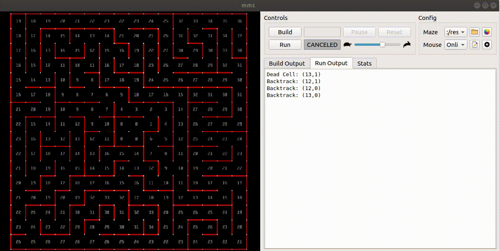
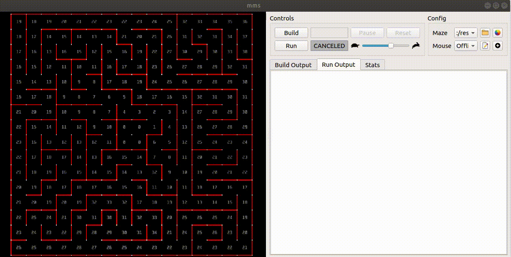

# mms-algorithms
Implement path finding algorithm using Micromouse simulator  
[Micromouse simulator](https://github.com/mackorone/mms)

### Algorithms:  
- [**Online DFS**](#online-dfs)      

- [**Offline DFS**](#offline-dfs)    


## Build 
```
mkdir build
cd build  
cmake .. && make  
```
## Run
Fill the executable file name in run command


## Algorithms
### Online DFS
### Ofline DFS
